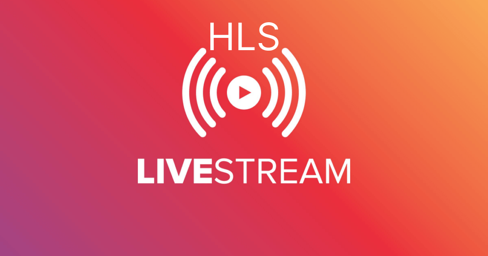

# Live Streaming Server with HLS

## Acknowledgments

A special thanks to [lalizita](https://github.com/lalizita) for their contributions to the [simple-live-streaming-server](https://github.com/lalizita/simple-live-streaming-server) repository. The configurations and inspiration from their work have been valuable in creating this repository.

This repository provides configurations for deploying a live streaming server with HLS (HTTP Live Streaming) using Nginx RTMP module. Choose your preferred deployment method:

- [Docker Compose](docs/docker-compose.md): Deploy the live streaming server using Docker Compose.
- [Kubernetes](docs/kubernetes-deploy.md): Deploy the live streaming server using Kubernetes.

## Objectives

1. **Functional Helm Chart**: Ensure the Helm chart is functional and can be used to deploy the live streaming server seamlessly.
4. **ECS service**: Allow users to deploy the live streaming server on aws ecs service.
2. **Customizable**: Allow users to customize the deployment based on their specific requirements.
3. **Scalable**: Allow users to scale the live streaming server based on their specific requirements.

## Docker Compose Deployment

For instructions on deploying the live streaming server using Docker Compose, refer to the [Docker Compose documentation](docs/docker-compose.md).

## Kubernetes Deployment

For instructions on deploying the live streaming server using Kubernetes, refer to the [Kubernetes documentation](docs/kubernetes-deploy.md).

---
### Additional Information

- [Nginx RTMP module documentation](https://github.com/arut/nginx-rtmp-module)
- [tiangolo/nginx-rtmp Docker image documentation](https://hub.docker.com/r/tiangolo/nginx-rtmp)
- [Helm documentation](https://helm.sh/docs/)

Feel free to explore and customize the configurations based on your specific requirements.
